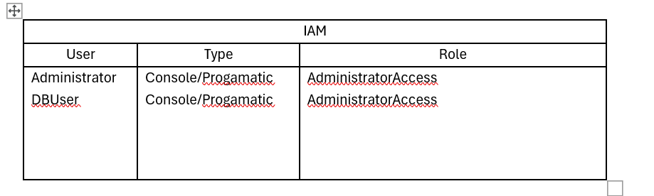

# Task 2

Applicant to complete a security assessment of a customer’s environment and come up with an improvement plan to improve security the security posture of their environment. 

## AWS example 

A customer has a simple environment that need to be looked at from a security point of view, as their developer has moved on, and no one really understands what is going on in their environment. What they do know, is that the application is running for some time without much attention. They do know that the EKS image hasn’t changed from the original installation (They think it’s apache 2.4-alphine). The certificate for the ELB was last changed two years ago. The ELB only has a single listener on TCP/80. The bastion has SSH running on it, and the customer is willing to share the credentials. 

 

 

 

 

 

 

